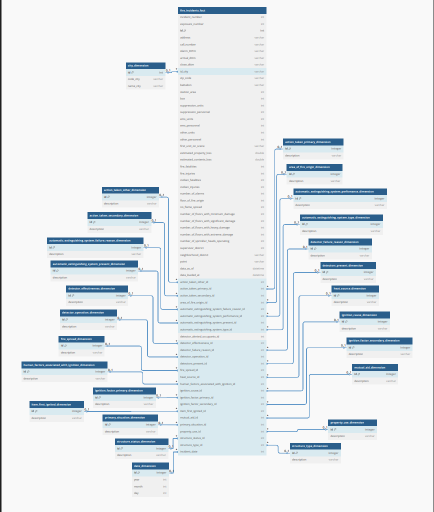

# Fire Incidents Data Warehouse

Este proyecto implementa una solución de ingeniería de datos para el análisis de incidentes de incendio en la ciudad de San Francisco.

---

## Tecnologías utilizadas

| Herramienta | Rol |
|-------------|-----|
| **Python** (`tn.py`) | Limpieza, normalización y carga a MySQL |
| **PySpark** | Framework con el que se realizan las transformaciones y acciones a los datos ingestados |
| **MySQL** (Docker) | Motor de base de datos |
| **DBT** | Modelado modular, documentación, tests |
| **Docker** | Contenedor de base de datos |
| **Power Bi** | Se crea un Dashboard para la visualizacion de los datos |

> [!IMPORTANT]  
> En la tabla de hechos en MySQL, se crearon índices sobre `incident_date`, `neighborhood_district` y `battalion`.  
> MySQL no permite particionar por múltiples columnas fácilmente, pero en un entorno productivo (como HIVE, Redshift, Athena, Databricks, etc.), estas serían claves ideales de partición.

---

## Objetivo del proyecto

Crear un modelo de datos escalable, limpio y eficiente para analizar información de incendios, permitiendo a equipos de BI consultar de forma flexible los incidentes según:

- `incident_date`
- `neighborhood_district`
- `battalion`

Además, se construyó un **modelo estrella** para optimizar el rendimiento analítico y la mantenibilidad.

---

## Arquitectura del proyecto

El proyecto se compone de:

1. **Un pipeline de preparación de datos (Python - `tn.py`)**
2. **Una base de datos en MySQL** con tablas fact y dimensiones (alojada en un contenedor de Docker)
3. **Un proyecto DBT** que permite modelado modular, tests y documentación
4. **Visualizacion realizada en PowerBi**

---

## Estructura del modelo de datos

La solución implementa un **modelo estrella**, donde:

- `fire_incidents_desnormalized` es la tabla de hechos
- Hay múltiples tablas de dimensiones asociadas

### Tabla de hechos: `fire_incidents_desnormalized`

Contiene todas las métricas reportadas en el dataset original provisto por la ciudad de San Francisco, como pérdidas estimadas, unidades de respuesta, lesiones, entre otros.

Y claves foráneas a dimensiones como:

- `property_use_id`
- `heat_source_id`
- `primary_situation_id`
- `battalion` 
- `city_id`, etc.

### Tablas de dimensiones

Cada dimensión tiene una forma estándar:

| Campo       | Tipo     | Descripción                         |
|-------------|----------|-------------------------------------|
| id          | string   | Código o categoría del valor        |
| description | string   | Descripción limpia y estandarizada |

---

## Pipeline

### Limpieza de datos, Normalizacion, Carga en MySQL

El script `tn.py`:

- Se normalizan y limpian todas las columnas categóricas que presentan valores inconsistentes, abreviados, duplicados o nulos, asegurando uniformidad semántica y sintáctica.
- Cada columna categórica es procesada y transformada en una tabla dimensión
- El script utiliza una conexión JDBC para crear e insertar en tablas:
    - `fire_incidents_desnormalized`
    - `*_dimension`

> [!IMPORTANT]  
> En este script, se realiza la insercion de datos en la BD MySQL, pero la idea seria insertar estos datos en un Data Lake donde se pueda particionar la data.

## Proyecto DBT

El proyecto DBT (`fire_case_project`) realiza:

### `models/staging/`

- `stg_fire_incidents.sql`: selecciona la tabla fact `fire_incidents_desnormalized`
- `schema.yml`: define tests y documentación para columnas clave

### `models/marts/`

Modelos agregados para análisis:

- `agg_fire_by_date.sql`
- `agg_fire_by_battalion.sql`
- `agg_fire_by_neighborhood.sql`
- `agg_fire_by_day_and_battalion.sql`

Todos estos modelos están:

- Materializados como `table`: Esto se debe a limitaciones del conector de DBT para MySQL, el cual no permite materializar modelos como vistas (`view`). Por esta razón, se optó por la materialización `table` aunque en entornos más avanzados lo recomendado sería `view` o `incremental`.
- Documentados en su propio `schema.yml`

---

## Actualización diaria

El modelo está diseñado para ejecutarse diariamente, cargando nuevos datos desde la fuente. Las opciones recomendadas son:

- Configuración incremental en modelos DBT
- Esto se puede orquestar con herramientas como Apache Airflow, Prefect, DBT Cloud o mediante workflows ofrecidos por servicios cloud (ej. AWS Step Functions, GCP Cloud Composer).

---

## Visualización

Los modelos agregados (`marts`) fueron consumidos en Power BI para construir dashboards que permiten analizar tendencias de incidentes por zona, fecha y tipo de evento.

---

## Cómo ejecutar el proyecto

1. **Iniciar MySQL en Docker**:

```bash
docker run --name mysql -e MYSQL_ROOT_PASSWORD=tu_pass -p 3306:3306 -d mysql
```

2. **Ejecutar limpieza y carga**:

```bash
python tn.py
```

3. **Ejecutar DBT**:

```bash
dbt run
dbt test
dbt docs generate
dbt docs serve
```

## Modelo entidad-relación (ERD)



> *El modelo representa una tabla de hechos y múltiples dimensiones, respetando las mejores prácticas de diseño analítico.*

