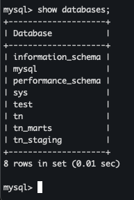
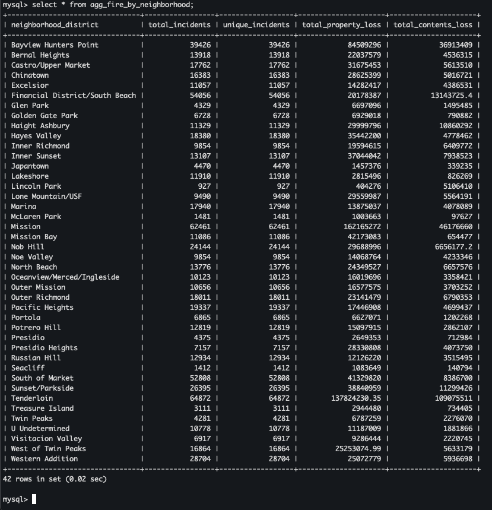

# Fire Incidents Data Warehouse

This project implements a data engineering solution for the analysis of fire incidents in the city of San Francisco.

---

## Technologies Used

| Tool           | Role                                                                 |
|----------------|----------------------------------------------------------------------|
| **Python** (`tn.py`) | Data cleaning, normalization, and loading into MySQL              |
| **PySpark**    | Framework for performing data transformations and actions            |
| **MySQL** (Docker) | Database engine                                                  |
| **DBT**        | Modular modeling, documentation, and tests                           |
| **Docker**     | Container for the MySQL database                                     |
| **Power BI**   | Used for creating the data visualization dashboard                   |

> **Note:**  
> In the MySQL fact table, indexes were created on `incident_date`, `neighborhood_district`, and `battalion`.  
> MySQL does not easily allow partitioning by multiple columns, but in a production environment (e.g., Hive, Redshift, Athena, Databricks), these would be ideal partition keys.

---

## Project Objective

Create a scalable, clean, and efficient data model to analyze fire incident information, allowing BI teams to flexibly query incidents by:

- `incident_date`
- `neighborhood_district`
- `battalion`

A **star schema** was also built to optimize analytical performance and maintainability.

---

## Project Architecture

The project consists of:

1. **A data preparation pipeline (Python - `tn.py`)**
2. **A MySQL database** with fact and dimension tables (hosted in a Docker container)
3. **A DBT project** enabling modular modeling, tests, and documentation
4. **A dashboard built in Power BI**

---

## Data Model Structure

A **star schema** is implemented, where:

- `fire_incidents_desnormalized` is the fact table
- There are multiple associated dimension tables

### Fact Table: `fire_incidents_desnormalized`

Contains all the metrics reported in the original dataset provided by the city of San Francisco, such as estimated losses, response units, injuries, and more.

And foreign keys to dimensions such as:

- `property_use_id`
- `heat_source_id`
- `primary_situation_id`
- `battalion`
- `city_id`, etc.

### Dimension Tables

Each dimension has a standard format:

| Field       | Type     | Description                           |
|-------------|----------|---------------------------------------|
| id          | string   | Unique code or category value         |
| description | string   | Cleaned and standardized description  |

---

## Pipeline

### Data Cleaning, Normalization, and Load into MySQL

The `tn.py` script:

- Normalizes and cleans all categorical columns with inconsistent, abbreviated, duplicated, or null values, ensuring semantic and syntactic uniformity.
- Each categorical column is processed and transformed into a dimension table.
- The script uses a JDBC connection to create and insert into:
    - `fire_incidents_desnormalized`
    - `*_dimension`

> **Note:**  
> The script inserts data into a MySQL DB, but ideally, this data would be loaded into a partitioned Data Lake.

---

## DBT Project

The DBT project (`fire_case_project`) performs:

### `models/staging/`

- `stg_fire_incidents.sql`: selects the fact table `fire_incidents_desnormalized`
- `schema.yml`: defines tests and documentation for key columns

### `models/marts/`

Aggregated models for analysis:

- `agg_fire_by_date.sql`
- `agg_fire_by_battalion.sql`
- `agg_fire_by_neighborhood.sql`
- `agg_fire_by_day_and_battalion.sql`

All models are:

- Materialized as `table` due to limitations with the MySQL DBT adapter, which doesn't support `view` materialization.
- Documented in their own `schema.yml`

---

## Daily Update

The model is designed to run daily, loading new data from the source. Recommended options:

- Configure incremental models in DBT
- Orchestrate using tools like Apache Airflow, Prefect, DBT Cloud, or cloud services (e.g., AWS Step Functions, GCP Cloud Composer)

---

## Visualization

Aggregated models (`marts`) were consumed in Power BI to build dashboards analyzing incident trends by zone, date, and event type.

---

## How to Run the Project

1. **Start MySQL in Docker**:

```bash
docker run --name mysql -e MYSQL_ROOT_PASSWORD=your_pass -p 3306:3306 -d mysql
```

2. **Run data cleaning and load**:

```bash
python tn.py
```

3. **Run DBT**:

```bash
dbt run
dbt test
dbt docs generate
dbt docs serve
```

---

## Entity-Relationship Model (ERD)


> **Note:**  
> The model includes a fact table and multiple dimensions, following best practices in analytical data design.

---

## Data Warehouse Description

This project implements a classic Data Warehouse architecture with zones for staging, a star schema, and analytical marts.

### Created Databases

- `tn`: main DB with fact and dimension tables
- `tn_staging`: staging schema
- `tn_marts`: analytical models created via DBT



### Fact and Dimension Tables

- `fire_incidents_desnormalized`: fact table
- `*_dimension`: dimension tables per categorical attribute


### Example of a Dimension Table


> **Note:**  
> All dimension tables follow a standard format:
> - `id`: unique normalized value
> - `description`: clean, readable label

### Staging Database


> **Note:**  
> Contains the intermediate table (`stg_fire_incidents`) used as source for DBT models.

### Marts Database


> **Note:**  
> Contains aggregated analytical models created via DBT, each answering a different business question.

### Model Examples




> **Note:**  
> These are examples of the created models.

---

## Dashboard

Power BI was used as the visualization tool.

> **Note:**  
> For educational purposes, only a 10K sample of records was used. This may affect aggregation accuracy and visual density in some charts.


The dashboard includes 8 charts + 1 date filter:

| Visualization                  | Description                                                       |
|--------------------------------|-------------------------------------------------------------------|
| 🗺️ Map                         | Spatial view of fire incident locations                          |
| 🧍 Civilian Injuries           | Total civilian injuries across incidents                         |
| 🔥 Fire-related Injuries       | Number of incidents involving injuries due to fire               |
| #️⃣ Total Incidents            | KPI showing total incident count                                 |
| 📅 Date Filter                 | Allows analysis over a selected time range                       |
| 🏙️ City Breakdown             | Proportion of incidents by registered city                       |
| 🏚️ Estimated Property Loss    | Sum of estimated property damage, grouped by battalion           |
| 📈 Monthly Trend               | Timeline showing incident trends over time                       |
| 🏘️ Neighborhood Incidents     | Neighborhoods with the highest number of incidents               |

> **Note:**  
> In a production setup, this dashboard would connect directly to a real-time data source or Data Lake.

Made by Diego Mosquera
